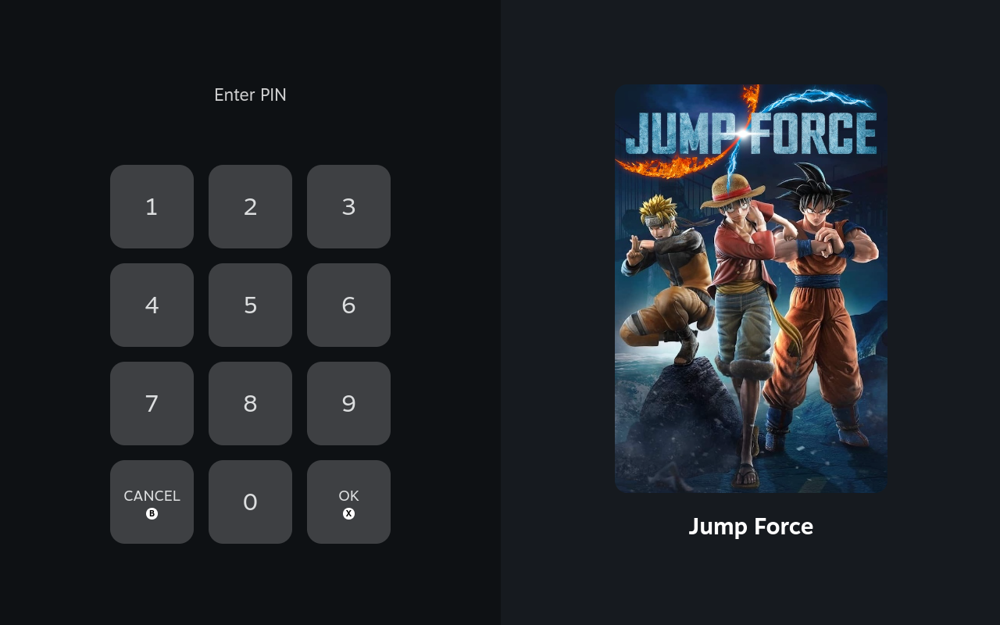
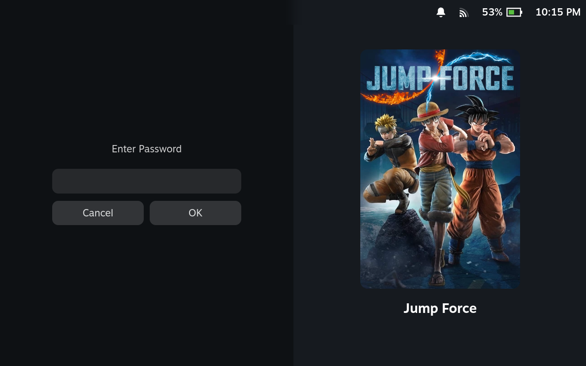
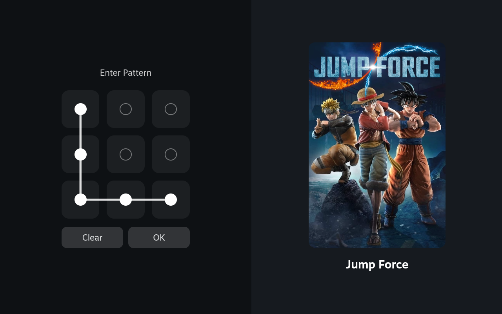
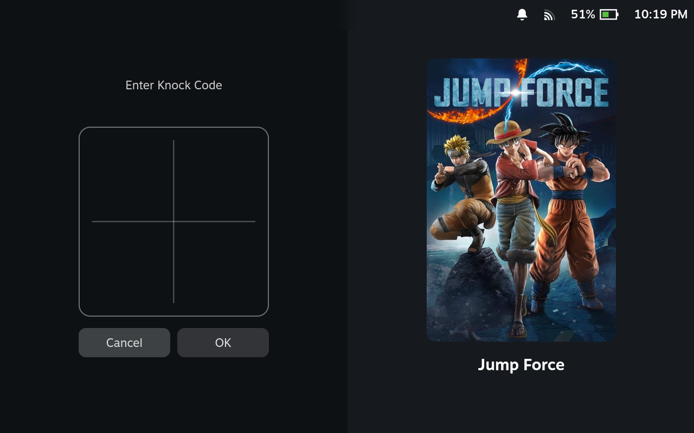
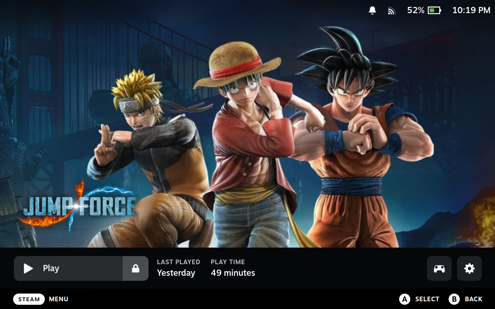
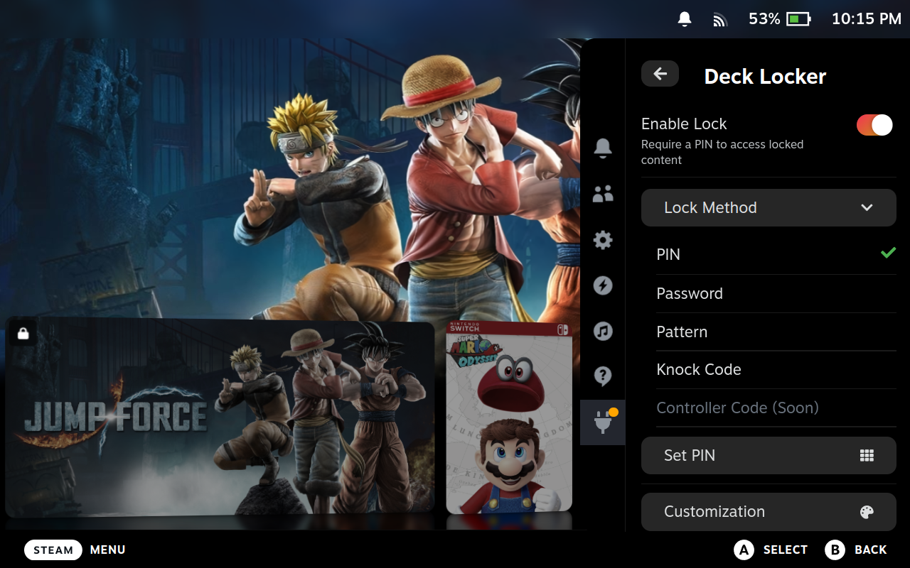

# Deck Locker

Lock games, plugins, Quick Access Menu tabs, and Steam Menu items behind a PIN, password, pattern, or Knock Code on your Steam Deck. Locked content stays inaccessible — from the library, context menus, Home shortcuts, or any other entry point — until the right credential is entered.

Built for the classic "someone borrows my Deck" problem: only the games you've approved are playable, everything else stays out of reach. 😜

## Features

- Lock individual games, Decky plugins, QAM tabs, and Steam Menu items independently
- Full-screen lock screen with game art (keypad, password field, pattern grid, or Knock Code, depending on your lock method), or a compact prompt for menus and panels
- Locked games show an optional lock badge on their cover art in Home, Recent, and the Library
- Unlocks last for the session — no repeated PIN entry until you re-lock or close the menu
- Deep customization: keypad shape/size, glass effect, background art, re-lock animation, and more
- Choose PIN, Password, Pattern, or Knock Code as your lock method — Controller Code is already on the settings menu, marked as it arrives

## Screenshots

<table>
<tr>
<td><br/><sub>PIN lock screen</sub></td>
<td><br/><sub>Password lock screen</sub></td>
</tr>
<tr>
<td><br/><sub>Pattern lock screen</sub></td>
<td><br/><sub>Knock Code lock screen</sub></td>
</tr>
<tr>
<td><br/><sub>Locked game shows a lock badge on Home</sub></td>
<td><br/><sub>Settings panel in the Quick Access Menu</sub></td>
</tr>
</table>

## Installation

Not yet available on the Decky Plugin Store — install manually:

1. Download the zip from the [latest release](https://github.com/jhonniledio/DeckLocker/releases/latest)
2. In Decky Loader, go to **Settings → Install Plugin from ZIP** and select the file

## Usage

1. Open the **Deck Locker** tab from the Quick Access Menu (⋯)
2. Toggle **Enable Lock**, pick a **Lock Method**, and set your credential
3. Expand any of the **Games**, **Plugins**, **Quick Menu**, or **Steam Menu** sections and toggle on what you want locked

Whatever you lock will prompt for your credential the next time it's opened. Games get a full lock screen; everything else gets a compact prompt in place. A locked game also gets a small re-lock button next to its Play button once unlocked.

### Forgot your PIN, password, pattern, or Knock Code?

1. Switch to **Desktop Mode** (Steam menu → Power → Switch to Desktop, or hold the Power button)
2. Open a terminal (Konsole, on the taskbar/app menu)
3. Run:
   ```bash
   cd ~/homebrew/plugins/DeckLocker/scripts
   ./reset-decklocker.sh
   ```
   (If it's not executable: `chmod +x reset-decklocker.sh` first.)
4. Confirm with `y` when prompted — it backs up your current `settings.json` (timestamped `.bak`) before wiping it
5. When asked, choose whether to restart the Decky plugin loader now to apply the reset immediately, or apply it later on the next Steam/plugin loader restart

Deck Locker then starts fresh with no credential set and everything unlocked.

## Notes

- This isn't a security guarantee against someone with direct filesystem access — it blocks normal in-UI access, not a determined attacker.
- Your PIN, password, pattern, or Knock Code is stored as a SHA-256 hash locally; it's never sent anywhere.
- Everything unlocks again on a Steam restart (and optionally on sleep, if you enable that).

## Building from source

Requires Node.js v16.14+ and pnpm v9.

```bash
pnpm install
pnpm run build
```

The built plugin is placed in `out/`.

## License

BSD 3-Clause — see [LICENSE](LICENSE).
